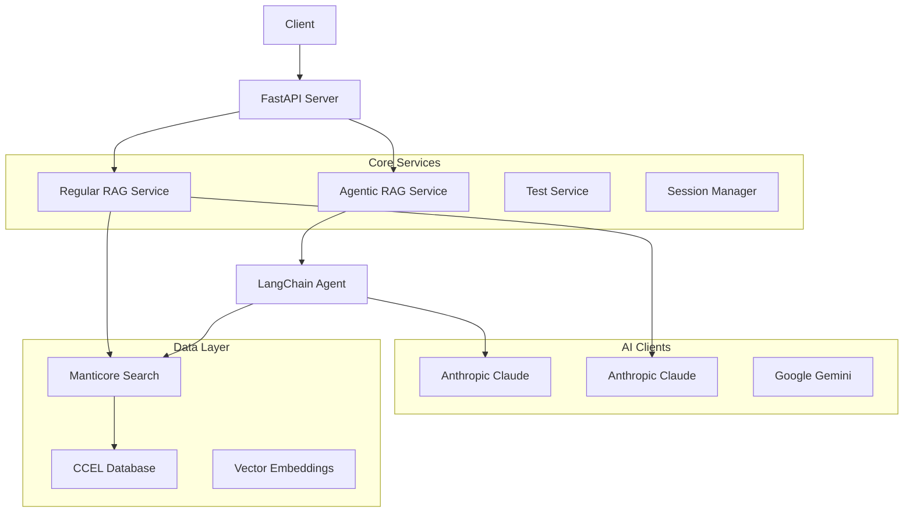

# 📚 Christian Library Assistant - Smart Theological Research API

A sophisticated RAG (Retrieval-Augmented Generation) powered API server that helps researchers, scholars, and students retrieve and analyze Christian texts from the CCEL (Christian Classics Ethereal Library). This system combines advanced AI capabilities with domain-specific search to provide intelligent, contextual answers to theological questions.

## 🌟 Key Features

### 🤖 Dual AI Systems
- **Regular RAG**: Fast, reliable retrieval-augmented generation
- **Agentic RAG**: Advanced reasoning with LangChain agents and tool usage
- **Comparative Testing**: Built-in endpoint to compare both approaches

### 🔍 Advanced Search Capabilities
- **Semantic Search**: OpenAI-powered embeddings for meaningful content discovery
- **Vector Search**: Manticore Search integration for high-performance retrieval
- **Contextual Understanding**: Domain-specific theological knowledge

### 🛠️ Research Tools
- **Session Management**: Persistent conversations with memory
- **Flexible Data Export**: Customizable response fields
- **Citation Generation**: Automated source attribution
- **Performance Monitoring**: Built-in timing and error tracking

### 📊 Analytics & Testing
- **A/B Testing**: Compare RAG approaches side-by-side
- **Performance Benchmarking**: Detailed timing and quality metrics
- **Error Handling**: Robust fallback mechanisms
- **Research Insights**: Extract patterns and cross-references

## 🏗️ Architecture



## 🚀 Quick Start

### Prerequisites

- **Python 3.8+**
- **Manticore Search Server** (configured and running)
- **API Keys**:
  - Anthropic Claude API key
  - OpenAI API key (for embeddings)
  - Google AI API key (optional)

### Installation

1. **Clone the repository**
   ```bash
   git clone https://github.com/christian-library-assistant/server.git
   cd server
   ```

2. **Set up Python environment**
   ```bash
   python -m venv venv
   source venv/bin/activate  # On Windows: venv\Scripts\activate
   pip install -r requirements.txt
   ```

3. **Configure environment variables**
   ```bash
   cp .env.example .env
   # Edit .env with your API keys and configuration
   ```

4. **Start the server**
   ```bash
   python main.py
   ```

The API will be available at `http://localhost:8000`

### Docker Setup (Alternative)

```bash
# Build the image
docker build -t christian-library-assistant .

# Run the container
docker run -p 8000:8000 --env-file .env christian-library-assistant
```

## 📖 API Documentation

### Core Endpoints

| Endpoint | Method | Description |
|----------|--------|-------------|
| `/test` | POST | 🧪 **Compare RAG systems** - Test queries without session state |
| `/test/fields` | GET | 📋 Get available response fields |
| `/query` | POST | 💬 Regular RAG query processing |
| `/query-agent` | POST | 🤖 Agentic RAG with session management |
| `/query-agent-reset` | POST | 🔄 Reset conversation memory |
| `/query-agent-session` | DELETE | 🗑️ Delete session |
| `/query-agent-sessions` | GET | 📊 Get session information |
| `/record-ids` | GET | 🔍 Get record IDs from text query |

### 🔄 Session Management

For **persistent conversations** with the agentic system, sessions are managed manually:

#### How Session IDs Work
- **Not Automatic**: You must provide your own session ID
- **Two Methods**: Pass via `X-Session-ID` header OR `session_id` in request body
- **Header Preferred**: `X-Session-ID` header takes precedence
- **Any String**: Use any unique identifier (UUIDs recommended)

#### Session Workflow Example
```bash
# 1. Start a conversation with a session ID
curl -X POST "http://localhost:8000/query-agent" \
  -H "Content-Type: application/json" \
  -H "X-Session-ID: my-research-session-123" \
  -d '{"query": "What did Augustine teach about grace?"}'

# 2. Continue the conversation (same session ID)
curl -X POST "http://localhost:8000/query-agent" \
  -H "Content-Type: application/json" \
  -H "X-Session-ID: my-research-session-123" \
  -d '{"query": "How does this compare to modern theology?"}'

# 3. Check session info
curl -X GET "http://localhost:8000/query-agent-sessions" \
  -H "X-Session-ID: my-research-session-123"

# 4. Reset conversation memory (keeps session alive)
curl -X POST "http://localhost:8000/query-agent-reset" \
  -H "X-Session-ID: my-research-session-123"

# 5. Delete session when done
curl -X DELETE "http://localhost:8000/query-agent-session" \
  -H "X-Session-ID: my-research-session-123"
```

#### Session ID Options
```bash
# Option 1: Header (Recommended)
-H "X-Session-ID: your-session-id"

# Option 2: Request Body
-d '{"query": "...", "session_id": "your-session-id"}'
```

### 🧪 Testing Endpoint - The Star Feature

The `/test` endpoint is perfect for research, experimentation, and comparison:

#### Basic Usage
```bash
curl -X POST "http://localhost:8000/test" \
  -H "Content-Type: application/json" \
  -d '{
    "query": "What is salvation?",
    "agentic": false,
    "return_fields": ["record_id", "text", "authorid"]
  }'
```

#### Advanced Research Query
```bash
curl -X POST "http://localhost:8000/test" \
  -H "Content-Type: application/json" \
  -d '{
    "query": "How did Augustine and Aquinas differ on divine grace?",
    "agentic": true,
    "top_k": 10,
    "return_fields": [
      "record_id", "text", "authorid", "workid", 
      "answer", "citation_text", "link"
    ]
  }'
```

### 📚 Comprehensive Documentation

- 📖 **[Complete API Reference](docs/api/api-reference.md)** - Full API documentation with input/output specifications
- 🧪 **[Testing Endpoint Guide](docs/api/testing-endpoint.md)** - Comprehensive testing documentation  
- 🚀 **[Quick Reference](docs/api/testing-endpoint-quick-ref.md)** - Fast lookup guide  
- 💡 **[Practical Examples](docs/api/testing-endpoint-examples.md)** - 17+ real-world scenarios

## 🔧 Configuration

### Environment Variables

```bash
# Required
ANTHROPIC_API_KEY=your_anthropic_key_here
MANTICORE_API_URL=http://your-manticore-server:9308

# Optional
GOOGLE_API_KEY=your_google_ai_key_here
```

### Manticore Search Setup

Ensure your Manticore Search server is configured with:
- CCEL text data indexed
- Vector embeddings for semantic search
- Proper field mappings for theological content

## 🎯 Use Cases

### 📚 Academic Research
- **Comparative Studies**: Compare theological positions across authors
- **Historical Analysis**: Track doctrinal development over time  
- **Citation Mining**: Extract and format scholarly references
- **Cross-Reference Analysis**: Find related passages and themes

### 🔬 AI Research & Development
- **RAG Evaluation**: Compare different retrieval approaches
- **Performance Benchmarking**: Measure response times and quality
- **Error Analysis**: Study failure modes and fallback scenarios
- **Prompt Engineering**: Test different query formulations

### 🏫 Educational Applications
- **Student Research**: Help students find relevant theological sources
- **Curriculum Development**: Identify key texts for course planning
- **Study Guides**: Generate contextual explanations
- **Question Answering**: Provide detailed theological answers

### 💼 Professional Ministry
- **Sermon Preparation**: Find relevant historical and theological content
- **Bible Study**: Discover commentary and interpretation resources
- **Counseling Support**: Access pastoral and theological guidance
- **Educational Resources**: Create teaching materials

## 🏗️ Project Structure

```
server/
├── 📁 src/                    # Main application code
│   ├── 📁 api/               # FastAPI routes and server setup
│   │   ├── endpoints.py      # API endpoint definitions
│   │   └── server.py         # FastAPI application factory
│   ├── 📁 core/              # Business logic and services
│   │   ├── 📁 agents/        # Agentic RAG system
│   │   │   ├── session_manager.py
│   │   │   └── theological_agent.py
│   │   ├── 📁 services/      # Core business services
│   │   │   ├── agent_service.py
│   │   │   ├── rag_service.py
│   │   │   ├── test_service.py
│   │   │   └── source_formatter.py
│   │   └── 📁 tools/         # Agent tools and utilities
│   ├── 📁 infrastructure/    # External integrations
│   │   ├── 📁 ai_clients/    # AI service clients
│   │   ├── 📁 parsers/       # Response handlers
│   │   └── 📁 search/        # Search service integration
│   ├── 📁 models/            # Data models and schemas
│   ├── 📁 prompts/           # AI prompt templates
│   └── 📁 config/            # Configuration management
├── 📁 docs/                  # Documentation
│   └── 📁 api/              # API documentation
├── 📁 tests/                 # Test suites
├── 📁 scripts/               # Utility scripts
├── main.py                   # Application entry point
├── requirements.txt          # Python dependencies
└── README.md                # This file
```

## 🧪 Testing

### Running Tests
```bash
# Run all tests
python -m pytest tests/

# Run with coverage
python -m pytest tests/ --cov=src --cov-report=html

# Run specific test file
python -m pytest tests/test_client.py -v
```

### Manual Testing
```bash
# Test the testing endpoint
curl -X GET "http://localhost:8000/test/fields"

# Basic health check
curl -X POST "http://localhost:8000/test" \
  -H "Content-Type: application/json" \
  -d '{"query": "test query"}'
```

## 🔍 Development

### Adding New Features

1. **New AI Clients**: Add to `src/infrastructure/ai_clients/`
2. **New Services**: Add to `src/core/services/`
3. **New Endpoints**: Add to `src/api/endpoints.py`
4. **New Tools**: Add to `src/core/tools/`

### Code Style

- **Type Hints**: Use comprehensive type annotations
- **Docstrings**: Document all public methods
- **Error Handling**: Implement proper exception handling
- **Logging**: Use structured logging throughout

### Environment Setup for Development

```bash
# Install development dependencies
pip install -r requirements-dev.txt

```

## 📊 Performance

### Benchmarks TODO


## 🚀 Deployment TODO

### Environment-Specific Configuration

```bash
# Development
export ENVIRONMENT=development
python main.py

# Production
export ENVIRONMENT=production
gunicorn main:app --host 0.0.0.0 --port 8000 --workers 4
```

## 🤝 Contributing

1. **Fork the repository**
2. **Create a feature branch**: `git checkout -b feature/amazing-feature`
3. **Make your changes**: Follow the coding standards
4. **Add tests**: Ensure your changes are tested
5. **Commit your changes**: `git commit -m 'Add amazing feature'`
6. **Push to the branch**: `git push origin feature/amazing-feature`
7. **Open a Pull Request**

### Contribution Guidelines

- **Code Quality**: Maintain high code quality with tests
- **Documentation**: Update documentation for new features
- **Backwards Compatibility**: Avoid breaking changes when possible
- **Performance**: Consider performance implications of changes

## 📄 License

This project is licensed under the MIT License - see the [LICENSE](LICENSE) file for details.

## 🆘 Support & Troubleshooting

### Common Issues

**1. Manticore Connection Error**
```bash
# Check if Manticore is running
curl http://your-manticore-server:9308/sql -d "SHOW TABLES"
```

**2. API Key Issues**
```bash
# Verify your .env file
cat .env | grep -E "(ANTHROPIC|GOOGLE|MANTICORE)"
```

**3. Slow Responses**
- Reduce `top_k` parameter
- Use fewer return fields
- Check Manticore server performance

### Getting Help

- **Issues**: [GitHub Issues](https://github.com/christian-library-assistant/server/issues)
- **Discussions**: [GitHub Discussions](https://github.com/christian-library-assistant/server/discussions)
- **Documentation**: Check the `/docs` directory

## 🔮 Roadmap

### Upcoming Features

- [ ] **Multi-language Support**: Support for Greek, Hebrew, Latin texts
- [ ] **Advanced Analytics**: Query pattern analysis and insights
- [ ] **Batch Processing**: Bulk query processing capabilities
- [ ] **Export Formats**: PDF, Word, and LaTeX export options
- [ ] **Authentication**: User management and API key system
- [ ] **Caching Layer**: Redis-based response caching
- [ ] **GraphQL API**: Alternative query interface
- [ ] **WebSocket Support**: Real-time query streaming

### Long-term Vision

- **Mobile App Integration**: Native mobile applications
- **Browser Extension**: Direct integration with research workflows
- **Academic Integration**: LMS and citation manager plugins
- **Advanced AI**: Integration with newer AI models and capabilities

## 🙏 Acknowledgments

- **CCEL (Christian Classics Ethereal Library)**: For providing the foundational text corpus
- **Anthropic**: For Claude AI capabilities
- **LangChain**: For agentic AI framework
- **FastAPI**: For the excellent web framework
- **Manticore Search**: For high-performance search capabilities

---

**Built with ❤️ for theological research and Christian scholarship**

*For more information, visit our [documentation](docs/) or check out the [API examples](docs/api/testing-endpoint-examples.md).*
