# JETON Testing Workflow - Visual Guide

## Testing Pipeline Overview

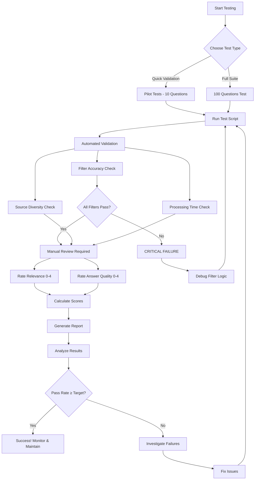

## Three Testing Scenarios

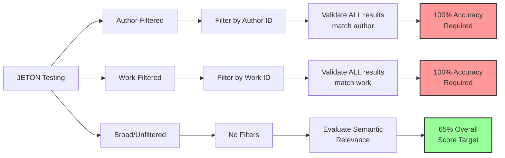

## Scoring Decision Tree

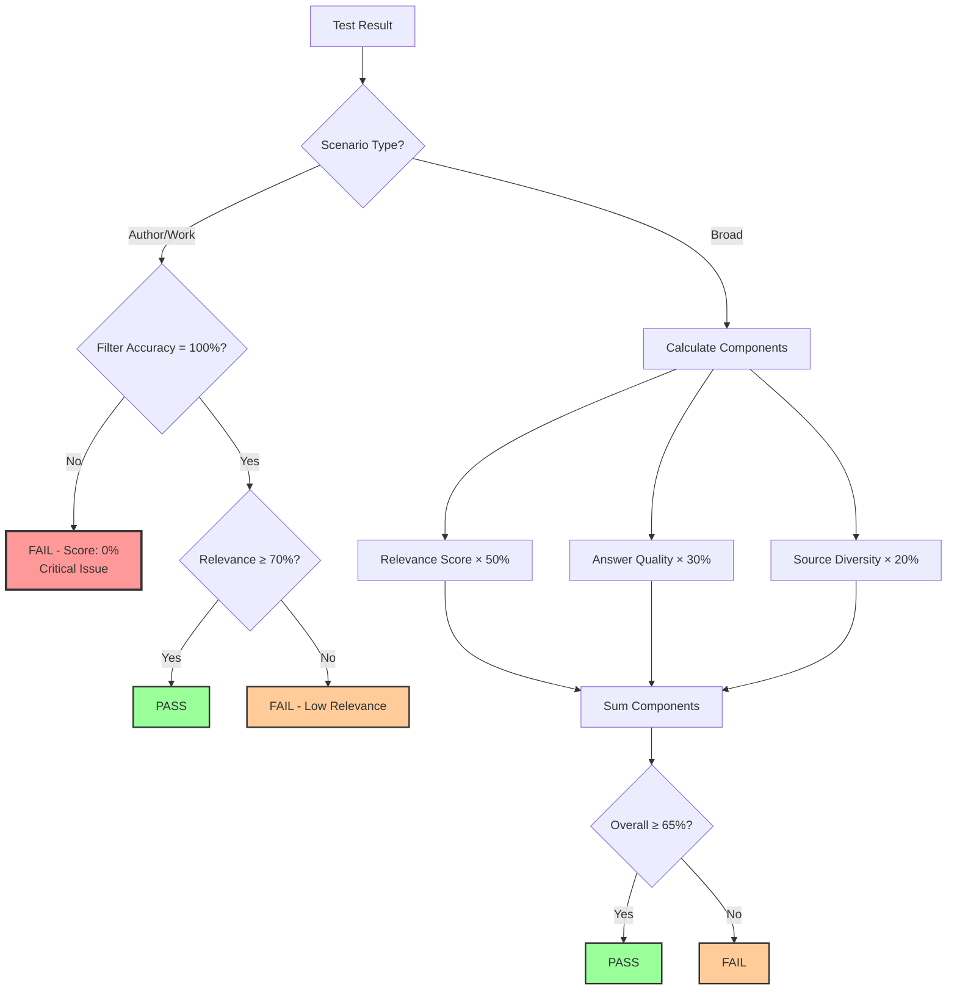

## Question Design Process

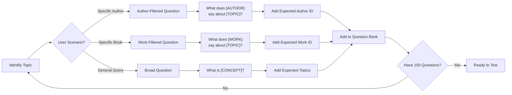

## Test Execution Flow

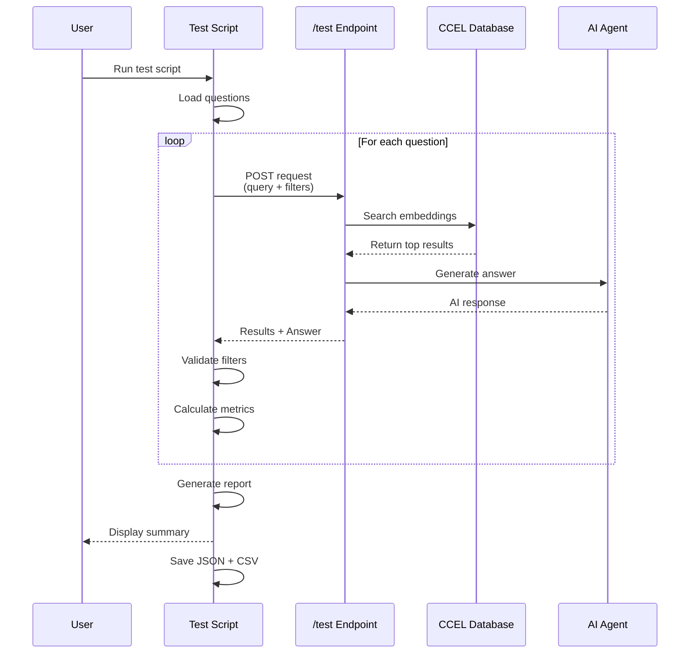

## Manual Review Process

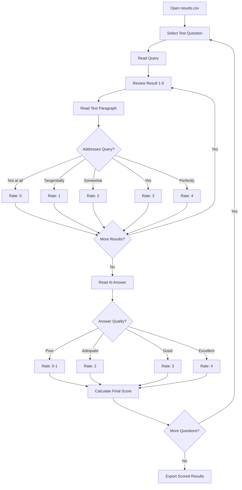

## Result Analysis Flow

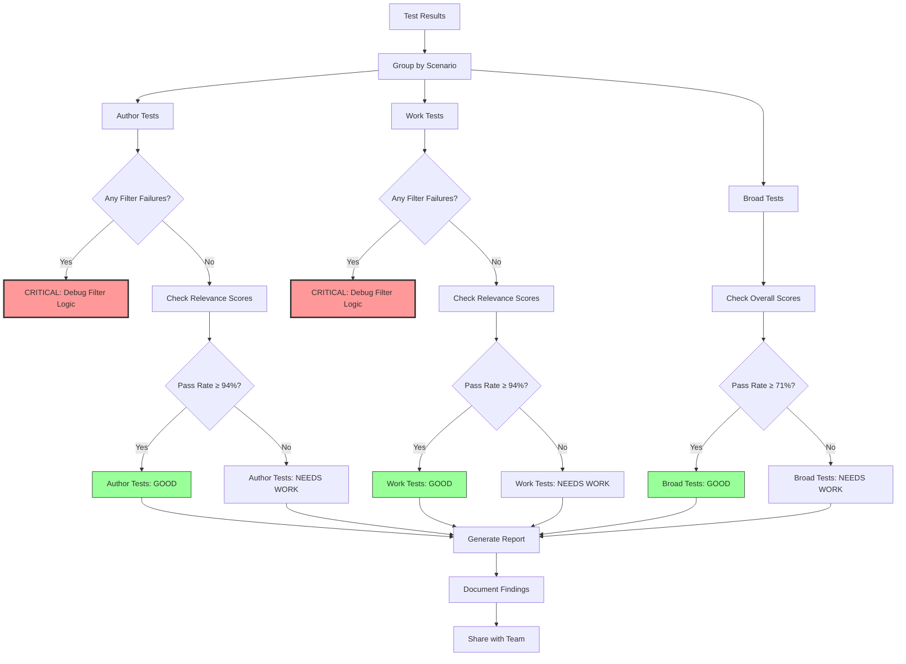

## Testing Maturity Levels

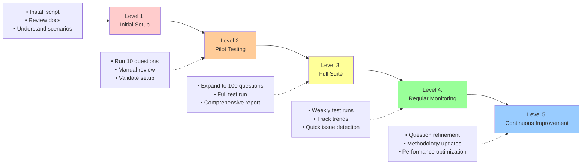

## Filter Validation Logic

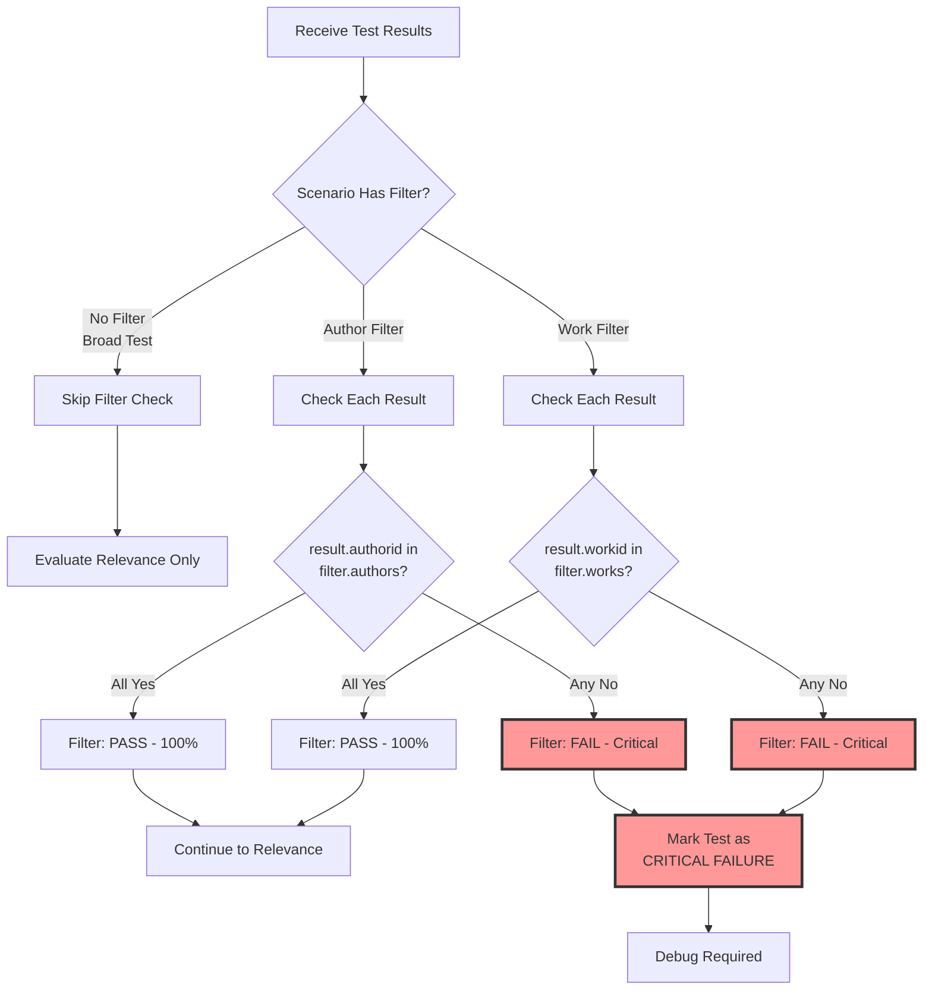

## Relevance Rating Guide

```
┌─────────────────────────────────────────────────────────────┐
│                    Relevance Rating Scale                    │
├────────┬──────────────────────┬────────────────────────────┤
│ Score  │ Label                │ Description                 │
├────────┼──────────────────────┼────────────────────────────┤
│   0    │ Completely           │ Text has nothing to do     │
│        │ Irrelevant           │ with query topic           │
├────────┼──────────────────────┼────────────────────────────┤
│   1    │ Tangentially         │ Topic mentioned but not    │
│        │ Related              │ addressing query           │
├────────┼──────────────────────┼────────────────────────────┤
│   2    │ Somewhat             │ Addresses part of query    │
│        │ Relevant             │ but not comprehensive      │
├────────┼──────────────────────┼────────────────────────────┤
│   3    │ Relevant             │ Clearly addresses query    │
│        │                      │ with good detail           │
├────────┼──────────────────────┼────────────────────────────┤
│   4    │ Highly               │ Directly answers query     │
│        │ Relevant             │ with excellent detail      │
└────────┴──────────────────────┴────────────────────────────┘
```

## Example Test Question Lifecycle

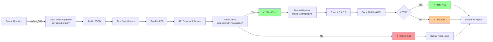

## Report Generation Flow

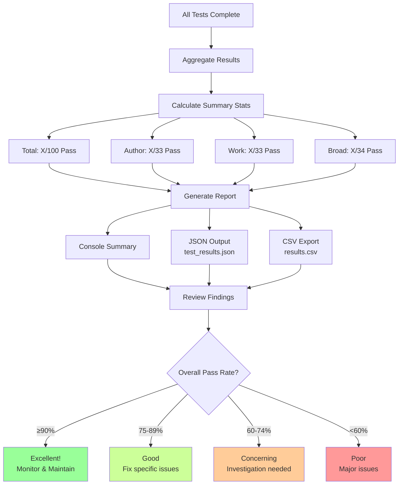

---

## Quick Reference Commands

**Note:** All test runs now auto-generate unique timestamped filenames to preserve testing history!

**Filename Format:** `test_results_{scenario}_{YYYYMMDD_HHMMSS}.json` and `.csv`

```bash
# Setup
cd /Users/david/CS_senior_project/JETON_SERVER/server
source venv/bin/activate
python main.py  # Start server

# Run Tests (in new terminal - auto-generates timestamped files)
python scripts/run_tests.py --pilot                    # → test_results_pilot_20251104_143022.json/csv
python scripts/run_tests.py --questions tests/sample_questions.json  # → test_results_all_...
python scripts/run_tests.py --questions tests/sample_questions.json --scenario author  # → test_results_author_...
python scripts/run_tests.py --questions tests/sample_questions.json --scenario work    # → test_results_work_...
python scripts/run_tests.py --questions tests/sample_questions.json --scenario broad   # → test_results_broad_...

# Custom Filenames (optional)
python scripts/run_tests.py --pilot --output custom.json              # Custom JSON name
python scripts/run_tests.py --pilot --output custom.json --csv custom.csv  # Custom both
```

---

## Visual Summary

```
┌─────────────────────────────────────────────────────────────┐
│              JETON Testing System Overview                   │
└─────────────────────────────────────────────────────────────┘

INPUT: 100 Questions
├── 33 Author-Filtered (What does [AUTHOR] say about X?)
├── 33 Work-Filtered   (What does [WORK] say about X?)
└── 34 Broad           (What is X?)

         ↓

EXECUTION: run_tests.py
├── Load questions from JSON
├── Send requests to /test API
├── Collect responses
└── Automatic validation

         ↓

VALIDATION
├── Automated Checks
│   ├── Filter accuracy (100% required)
│   ├── Source diversity
│   └── Processing time
│
└── Manual Review
    ├── Relevance rating (0-4)
    └── Answer quality (0-4)

         ↓

OUTPUT
├── Console: Summary stats
├── JSON: Complete raw data
└── CSV: Manual review spreadsheet

         ↓

ANALYSIS
├── Pass/Fail by scenario
├── Performance metrics
├── Issue identification
└── Recommendations

         ↓

ACTION
├── Fix critical issues
├── Refine questions
├── Improve system
└── Retest
```

---

**Note:** These diagrams are written in Mermaid syntax. They will render automatically in:
- GitHub
- GitLab  
- Many markdown editors
- VS Code (with Mermaid extension)
- Online: https://mermaid.live/

To view, paste the code blocks into any Mermaid-compatible viewer.

---

**Created:** November 4, 2025  
**Purpose:** Visual guide to JETON testing workflow

